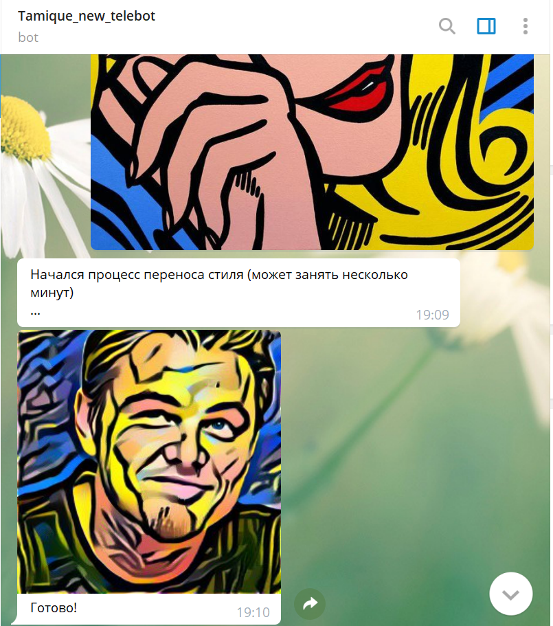

# Style transfer bot project
В данном проекте реализован телеграм бот по переносу стиля между изображениями.

В качестве фреймворка для бота был использован **pyTelegramBotAPI**: https://github.com/eternnoir/pyTelegramBotAPI

В качестве фреймворка дял переноса стиля был использован **PyTorch**: https://pytorch.org/

Реализавано все в сервисе **Google Colab Pro**

Ник бота: @Tamique_new_telebot_bot

## Функционал бота

Реализовано 2 команды:
  1) /start - знакомит пользователя с ботом и содержит ссылку на команду /help
  2) /help - дает краткое описание функциональна бота

Функционал: Сначала на вход подается изображение-контент, сразу после этого изображение-стиль. Псоле этого начинается процесс работы модели(около1-2 минут). В итоге, бот выдаст пользователю изображение-результат работы модели.

## Примеры

Ниже представлены примеры работы бота:

Больше примеров содержится в папке images

В той же папке созданы папки *content* и *style*, в которых можно взять изображения для тестирования бота.

## Результаты работы бота

## Планы

  1. Сделать бота более гибким в 'общении', добавить больше команд.
  
  2. Реализовать возможность выбора стиля.
  
  3. Из-за нехватки времени не удалось задеплоить бота, поэтому я воспользовался механизмом обхода ошибок
  
    while True:
      try:
          bot.polling(none_stop=True, interval=0)
      except: 
          time.sleep(5)
          
   Планирую задеплоить бота на облачной платформе( Heroku/PythonAnywhere/AWS)
